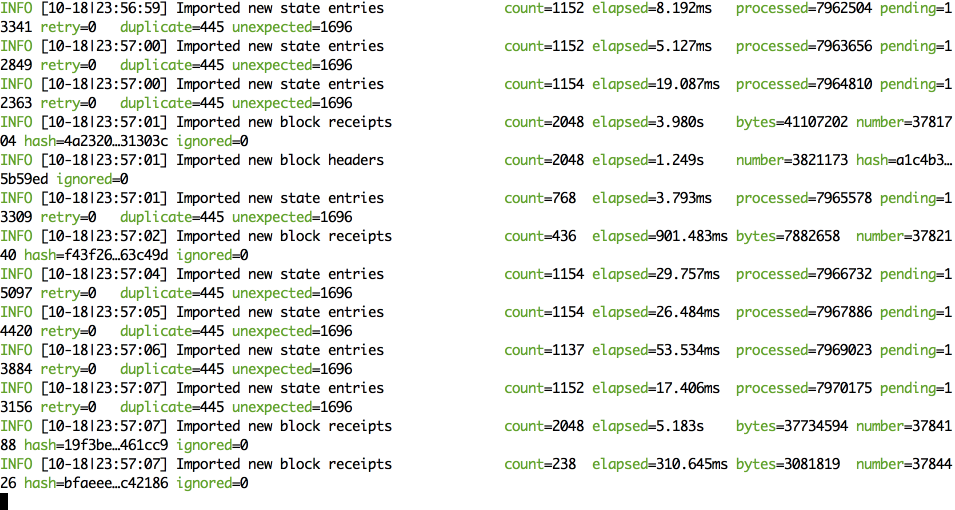
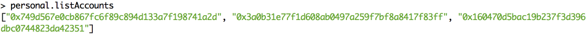
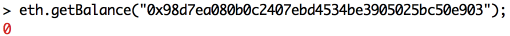
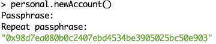
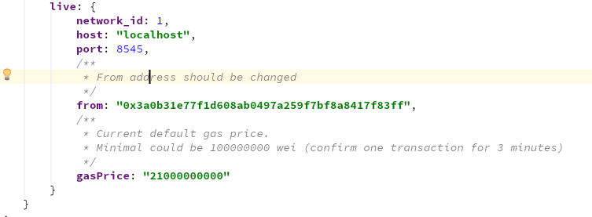
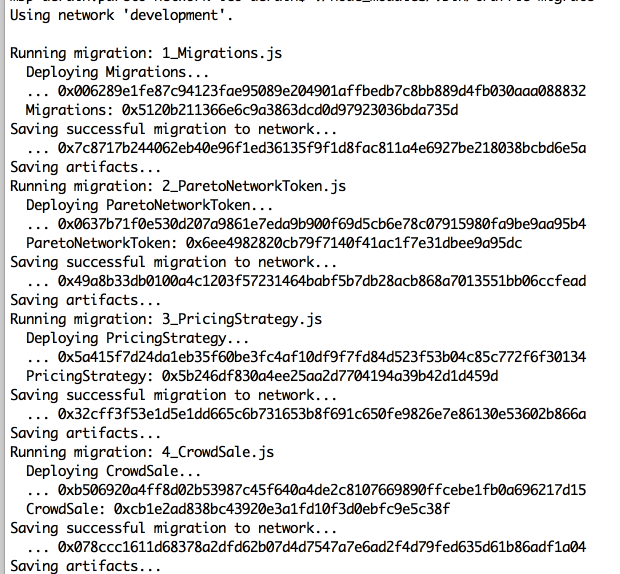

# Ubuntu Deployment Guide
       
## Requirements
- [nodejs LTS](https://nodejs.org/uk/download/)
- [Ethereum geth client](https://github.com/ethereum/go-ethereum/releases])

All commands should be put in Mac OS Terminal application or iTerm

Attach to the geth console reminder: `geth attach ~/.ethereum/geth.ipc`  

## Install dependencies
1. Install system dependencies:   
  `sudo apt-get install libgmp-dev`      
  `sudo apt-get install build-essential`  
2. Require NodeJS 8+ https://nodejs.org/en/download/package-manager/
Install nodejs and npm: `sudo apt-get install nodejs`
3. Get the project code and run in the project root: `$ npm install`   
4. Install Ethereum geth client: [https://github.com/ethereum/go-ethereum/wiki/Installation-Instructions-for-Ubuntu](https://github.com/ethereum/go-ethereum/wiki/Installation-Instructions-for-Ubuntu)    
5. Run geth node with RPC API allowed in separate terminal window. : `$ sudo geth --networkid 1 --syncmode fast` or you could try light client mode (experimental): `$ sudo geth --networkid 1 --syncmode light`  
Node will download about 22GB of data. You could check actual size of the fast mode chain here: [Chain Data Set](https://etherscan.io/chart2/chaindatasizefast)  
It could take a while. Grab a coffee!  
  

## Ethereum wallet account
You need Wallet account for the deployment into Ethereum live network. Here is a few ways to get the account. 
You could restore account or create a new one:

### Restore the account
1. Put the keystore account file in the `~/.ethereum/keystore/`  
2. Attach to the geth console: `$ geth attach ~/.ethereum/geth.ipc`  
3. In console type `personal.listAccounts`. You will get a list of accounts addresses stored in `~/.ethereum/keystore/`

4. Check account balance: `eth.getBalance("address of account");`
  
5. Don't forget to remember your account public address.  

### Create new account
1. Attach to the geth console: `$ geth attach ~/.ethereum/geth.ipc`
2. Type `personal.newAccount()`. You will be prompted to enter the password. Don't forget the password and store it into secure location.
  
You will find json keystore file related to the new account in the `~/.ethereum/keystore/` directory. Save it into secure location.
3. Check account balance: `eth.getBalance("address of account");`

4. Don't forget to remember your account public address.  

### You should unlock an account for truffle framework before deployment.
1. Attach to the geth console: `geth attach ~/.ethereum/geth.ipc`
2. Type in geth console `web3.personal.unlockAccount("account public address","password",15000);`   
This command will unlock the selected account for the 15000 seconds.
    
More info about accounts is [here](https://theethereum.wiki/w/index.php/Accounts,_Addresses,_Public_And_Private_Keys,_And_Tokens)

## Migrate the contracts
**Before migration you should finish geth node synchronization. Node should download about 22GB of chaindata before it's get synced.**

1. Unlock account for the truffle via geth console (for the 15000 seconds): `web3.personal.unlockAccount("account public address","password",15000);`  
2. In the root of the project code you could find the `/truffle-config.js` configuration file.   
In this file you will see a live network definition with some params to change:
   `from` - this if account address from truffle will be process deployment. This address will be owner of the tokens and all contracts by default.  
       
   You could find account address via geth console: `personal.listAccounts` and then check account balance.  
   Also you could get an address from the keystore file in the `~/.ethereum/keystore/` directory.
3. Change the `gasPrice` if needed. Current gas price (*21000000000 Wei*) is default for the Ethereum wallets and one transaction will be commited in the *2 minutes*.    
   Minimal available value is: *100000000 Wei* and one transaction could be commited in the *10 minutes*.

 
4. Before starting migration please check balance of yours deployment wallet (field `from` in the `/truffle-config.js`)
5. Compile the contracts `$ ./node_modules/.bin/truffle compile`   
6. Deploy the contracts `$ ./node_modules/.bin/truffle migrate --network live`    
7. Deployment could take a while. Grab a coffee again!   
8. Finally you should get a report with addresses of all deployed contracts.

  
  
## References
More info about deploy to the live network [here](http://truffleframework.com/tutorials/deploying-to-the-live-network)
  
Deploy to the any public network [without ethereum node](http://truffleframework.com/tutorials/using-infura-custom-provider)

